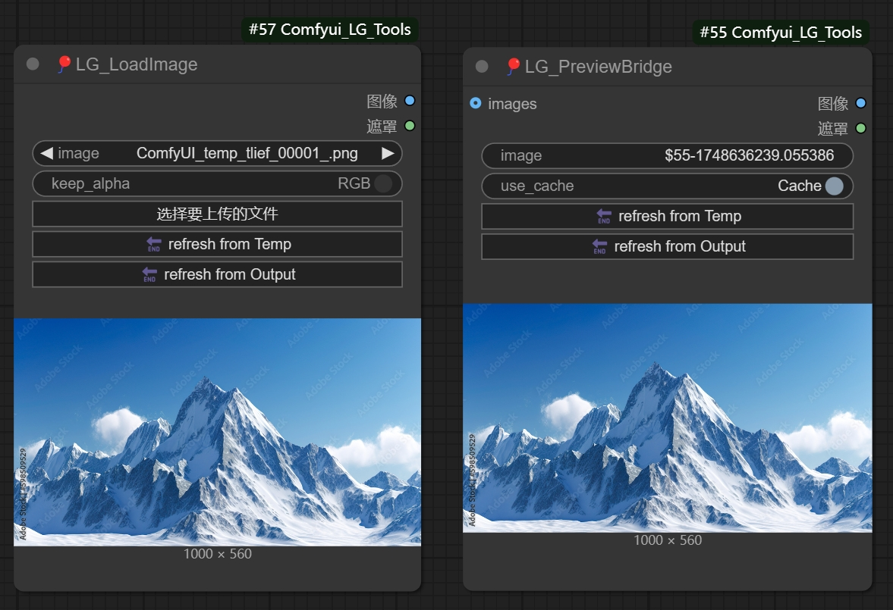

# ComfyUI_LG_Tools

This is a **toolset designed by LG_Laogou** as part of his learning notes for ComfyUI. It provides a collection of practical image processing and manipulation nodes, making operations more intuitive and efficient.

---

## 🛠️ Installation Instructions

1. Make sure ComfyUI is installed.
2. Clone this repository into the `custom_nodes` folder of your ComfyUI installation:

```bash
cd ComfyUI/custom_nodes
git clone https://github.com/LAOGOU-666/Comfyui_LG_Tools.git
```

3. Install the required dependencies:

```bash
pip install -r requirements.txt
```

---

## 🚀 How to Use

1. Launch ComfyUI.
2. Right-click in the node workspace. All tools will be available under the **"🎈LAOGOU"** category.
3. Drag and drop the nodes you need into the workspace and connect them accordingly.

---

## 🧩 Node Descriptions

### ✂️ Image Crop Node


- Left-click and drag to select the area you want to crop.

---

### 📏 Resize Image Node


---

### 🎨 Color Adjustment Node


---

### 🖌️ FastCanvas Node


- Supports real-time composition adjustments and selected layer masking.
- Batch composition supported — input layers can inherit position/scale from previous layers.
- Canvas window size can be limited to avoid large images taking up too much space.
- Right-click to access context menu options like **Transform**, **Set as Background**, and more.
- Supports input from ports (`bg_img`, `img`) or can be used standalone.
- Allows image manipulation via copy-paste, drag & drop, and direct upload.

> ⚠️ **Note on image inputs:**  
> - `bg_img`: RGB image for background  
> - `img`: Layer image (supports RGB/RGBA)  
> - The default `LoadImage` node only outputs **RGB** — to use **RGBA**, you must merge an ALPHA channel manually!

---

### 🔀 Switch Node


- One-click to enable/disable single or multiple groups of nodes.
- Supports **lazy evaluation** via `lazyswitch` — only executes selected branches.
- Right-click on the node to configure different modes: Ignore or Disable.

---

### 🎚️ Noise Node


- Adds custom noise to images as a preprocessing step.

---

### 🌉 Cache Preview Bridge Node


- Click the **Cache** button after sending an image input to cache it — allows mask editing without resetting.
- Once cached, the image/mask remains unchanged even if input is disconnected or refreshed.
- Supports copy functionality — acts like a combination of LoadImage + CachePreviewBridge, great for complex workflows and repeated tasks.

---

### 🔄 LoadImage + CachePreviewBridge (Updated Version)


- Added **Refresh** feature: one-click to load the most recent image from the `temp/output` folders.
- Saves time during iterative workflows — no more manual copy/paste!

---

## ⚠️ Important Notes

- These nodes were separated from the original **LG_Node** package.
- If you purchased LG_Node previously and would like to use this toolset, please contact the author to obtain the latest version and avoid node conflicts.

---

## 🤝 Collaboration / Custom Builds / Tutorials for Beginners

- **WeChat:** `wenrulaogou2033`  
- **Bilibili:** [老狗_学习笔记](https://space.bilibili.com/)
