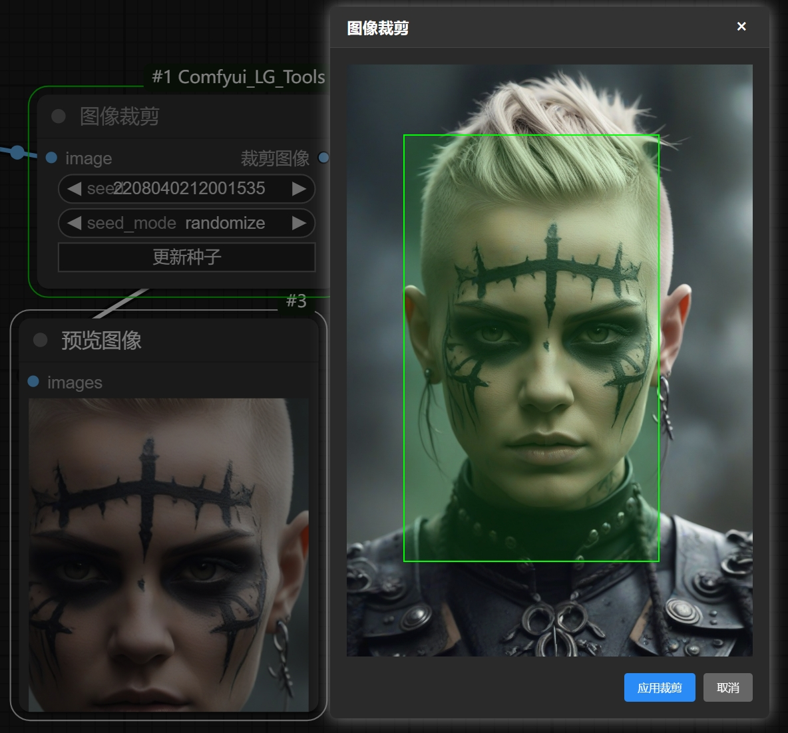
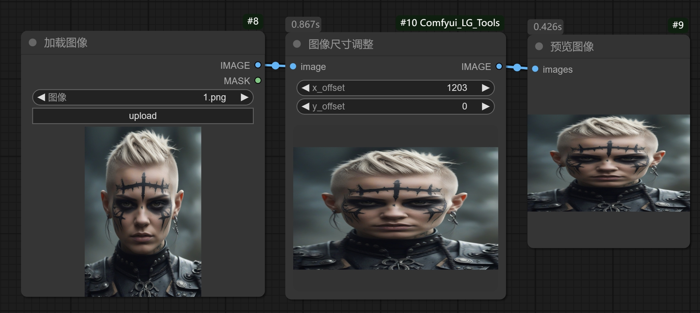
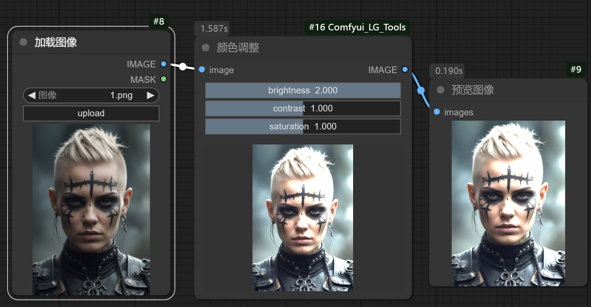
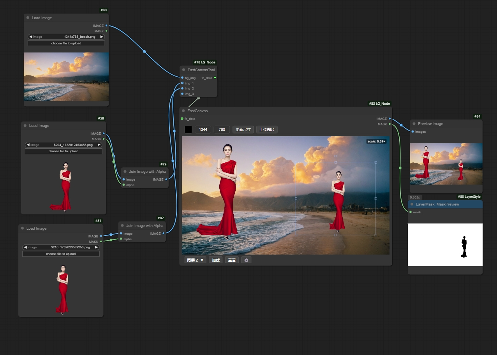
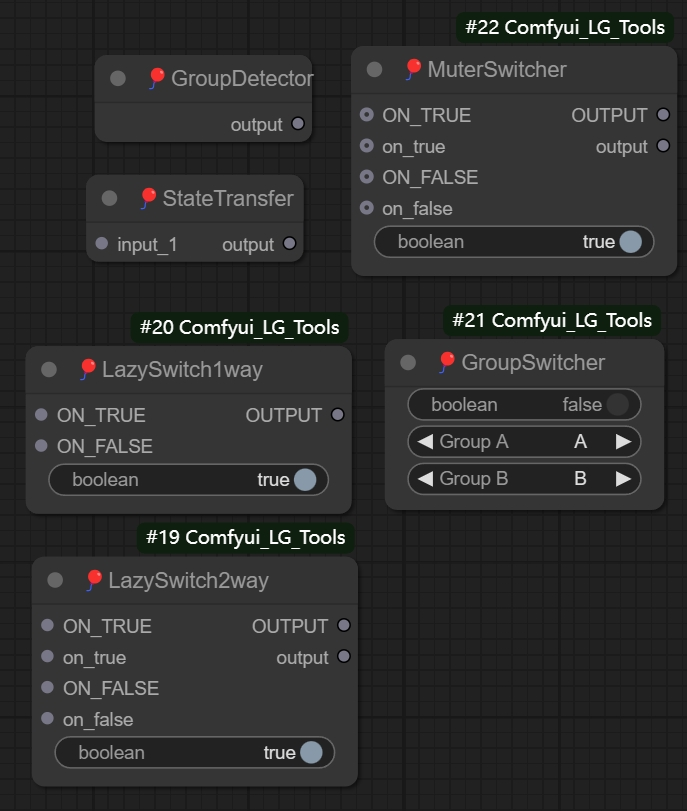
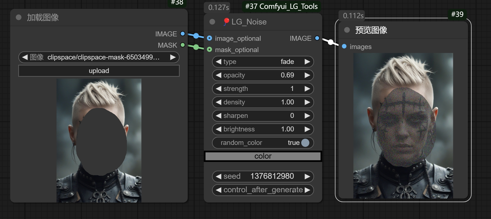

# Comfyui_LG_Tools

这是***LG_老狗的学习笔记***为ComfyUI设计的工具集，提供了一系列实用的图像处理和操作节点，让我们的操作变得更加直观方便

## 安装说明

1. 确保已安装ComfyUI
2. 将此仓库克隆到ComfyUI的`custom_nodes`目录下：
```bash
cd ComfyUI/custom_nodes
git clone https://github.com/your-username/Comfyui_LG_Tools.git
```

3. 安装依赖：
```bash
pip install -r requirements.txt
```

## 使用方法

1. 启动ComfyUI
2. 在右键添加节点中，您可以在"🎈LAOGOU"类别下找到所有工具节点
3. 将需要的节点拖入工作区并连接使用

## 节点说明

### 图像裁剪节点

- 点击左键框选指定范围进行裁剪
### 图像尺寸调整节点


### 颜色调整节点


### FastCanvas画布节点

> * 1.支持实时调整构图输出图像和选中图层遮罩
>
> * 2.支持批量构图，切换输入图层继承上个图层的位置和缩放
>
> * 3.支持限制画布窗口视图大小的功能，不用担心图片较大占地方了
>
> * 4.图层支持右键辅助功能，变换，设置背景等，点开有惊喜
>
> * 5.支持通过输入端口输入图像，
      支持无输入端口独立使用，
>
> * 6.支持复制，拖拽，以及上传方式对图像处理
>
注意！fastcanvas tool动态输入节点使用方法：
* bg_img输入背景RGB图片，img输入图层图片，可以输入RGB/RGBA图片
* **系统自带的加载图片节点默认输出的是RGB!不是RGBA（带遮罩通道的图片）!使用加载图像输入RGBA需要合并ALPHA图层！**
### 开关节点

- 一键控制单组/多组的忽略或者禁用模式
- 惰性求值开关lazyswitch（仅运行指定线路，非指定线路无需加载）
- 注意！点击开关节点右键有设置不同模式（忽略和禁用）的功能

### 噪波节点

- 添加自定义噪波以对图像进行预处理

### 桥接预览节点


> * 当你使用input模式将图片输入到节点后，编辑好遮罩然后点击Cache按钮，节点会缓存当前的图片和遮罩
>
> * 在点击Cache按钮后，无论输入端口是否连接，是否刷新，都不会影响当前缓存的图片和遮罩，你可以继续在当前节点编辑遮罩并且不会重置缓存
>
> * 现在支持复制功能，相当于加载图片节点和桥接预览节点的集合，对于需要重复操作以及大型工作流的缓存处理能提供很大便利

## 注意
* 因为该库的节点是从LG_Node里面拆分出来的，之前购买过LG_Node的如果需要使用这个节点包，请联系我获取新的版本以避免出现节点冲突

## 合作/定制/0基础插件教程
- **wechat:**  wenrulaogou2033
- **Bilibili:** 老狗_学习笔记